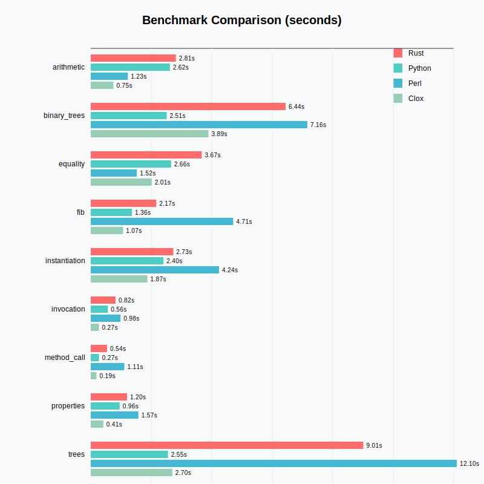

# lox-lang

Lox language interpreter written in Rust

## Run

```kt
fun main() {
    print "hello world!"
}

main();
```

`cargo run example.lox`

## Test

`cargo test`

> Most of the test and benchmark files are copied from [Crafting Interpreters](https://github.com/munificent/craftinginterpreters) repository. The copyright for these belongs to Bob Nystrom and are copied here because their license allows it (MIT).

## Benchmark



### Rust (this interpreter)

```
$ python3 run_lox_benchmarks.py lox 
Running benchmarks for lox... tests/benchmarks/lox
arithmetic.lox: 3.3141
binary_trees.lox: 6.9633
equality.lox: 3.446
fib.lox: 2.2906
instantiation.lox: 3.8471
invocation.lox: 0.8686
method_call.lox: 0.5834
properties.lox: 1.3262
trees.lox: 9.9809
zoo.lox: 1.0522
```

### Python v3.12.3

```
$ python3 run_lox_benchmarks.py python
Running benchmarks for python... tests/benchmarks/python
arithmetic.py: 2.617
binary_trees.py: 2.5121
equality.py: 2.6572
fib.py: 1.3623
instantiation.py: 2.4031
invocation.py: 0.5649
method_call.py: 0.2729
properties.py: 0.9565
trees.py: 2.5539
zoo.py: 0.7307
```

### Perl v5.34.1

```
$ python3 run_lox_benchmarks.py perl  
Running benchmarks for perl... tests/benchmarks/perl
arithmetic.pl: 1.2259
binary_trees.pl: 7.158
equality.pl: 1.5235
fib.pl: 4.7082
instantiation.pl: 4.24
invocation.pl: 0.9832
method_call.pl: 1.11
properties.pl: 1.574
trees.pl: 12.1001
zoo.pl: 1.2363
```

### Clox (Crafting Interpreters)
```
$ python3 run_lox_benchmarks.py clox
Running benchmarks for clox... tests/benchmarks/lox
arithmetic.lox: 0.749
binary_trees.lox: 3.8906
equality.lox: 2.0149
fib.lox: 1.0654
instantiation.lox: 1.8701
invocation.lox: 0.2706
method_call.lox: 0.1883
properties.lox: 0.4145
trees.lox: 2.6955
zoo.lox: 0.3104
```
